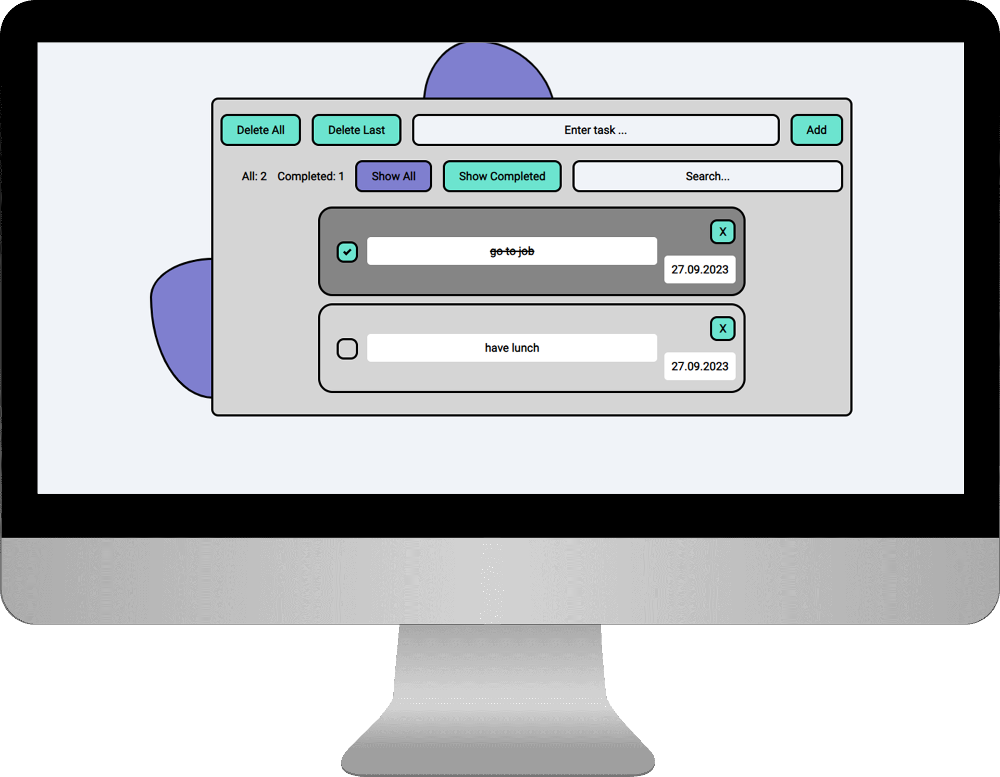
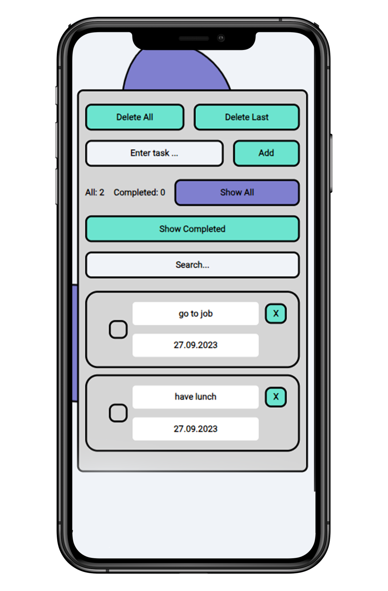

# Todo List

### About The Project

The Todo List project is my pet project, which is a simple task management app.
The project is an adaptive application that easily adapts to different devices and screens

  
  

   

Demo: [**Task List**](dmitrylasuta.github.io/Todo-List/)

## Built With:

   

- HTML, CSS and JavaScript: for creating the user interface and application functionality.
- LocalStorage: for storing task data and its state between sessions.

## What I learned doing the project:

In the process of developing this project, I've acquired the following skills and knowledge:

- **DOM manipulation:** using JavaScript to `manipulate HTML` elements and `update the interface` when interacting with the application.

- **Using localStorage:** learning how to work with the `browser's data storage` to save and restore the task state.
- **Event handling:** using event listeners to `respond to user actions` such as adding or removing tasks.
- **Code organization:** `dividing functionality into modules` and `using module imports and exports` in JavaScript to create a cleaner and modular code structure.

This project allowed me to apply and deepen my JavaScript skills, as well as develop skills in HTML and CSS. I also learned how to effectively use localStorage for data persistence in the browser. This experience will be valuable for developing more complex web applications in the future.
